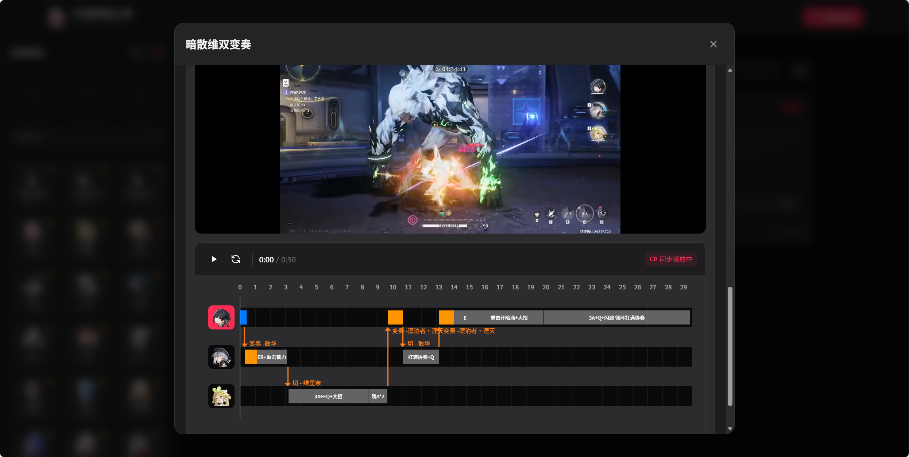

# 鸣潮排轴工具

> 基于 Vue3 + Django 的鸣潮配队管理与输出轴工具

## 项目简介

鸣潮游戏配队轴工具，支持配队管理、角色筛选、输出流程记录、视频上传与裁剪等功能。



## 技术栈

### 前端
- **框架**: Vue 3 (Composition API)
- **构建工具**: Vite
- **样式**: TailwindCSS

### 后端
- **框架**: Django 5.x
- **API**: Django REST Framework
- **视频处理**: FFmpeg (imageio-ffmpeg)

## 项目结构

```
.
├── frontend/                 # Vue3 前端项目
│   ├── src/
│   │   ├── components/     # Vue 组件
│   │   │   ├── RotationEdit.vue      # 输出轴编辑组件
│   │   │   ├── RotationPlayer.vue    # 输出轴播放组件
│   │   │   ├── TeamCard.vue          # 配队卡片
│   │   │   ├── TeamDetailModal.vue   # 配队详情弹窗
│   │   │   ├── AddTeamModal.vue      # 添加配队弹窗
│   │   │   └── CharacterFilter.vue   # 角色筛选组件
│   │   ├── services/api.js  # API 服务
│   │   ├── App.vue          # 根组件
│   │   └── main.js          # 入口文件
│   ├── public/assets/      # 静态资源
│   │   ├── characters/     # 角色头像 (48个角色)
│   │   └── icons/          # 元素/武器图标
│   ├── package.json
│   └── vite.config.js
│
├── backend/                  # Django 后端项目
│   ├── api/                 # API 应用
│   │   ├── models.py        # 数据模型
│   │   ├── views.py         # 视图函数
│   │   └── serializers.py  # 序列化器
│   ├── core/                # 项目配置
│   │   └── settings.py      # Django 配置
│   └── manage.py
│
└── README.md
```

## 快速开始

### 1. 启动后端

```bash
cd backend
python manage.py runserver
```

后端运行在 http://127.0.0.1:8000

### 2. 启动前端

```bash
cd frontend
npm install
npm run dev
```

前端运行在 http://localhost:5173

## 功能特性

### 配队管理
- 创建、编辑、删除配队
- 配队名称、备注、难度、环境设置
- DPS/矩阵分数记录
- 贡献者标记

### 角色系统
- 48个鸣潮角色数据
- 按星级 (4星/5星) 筛选
- 按武器类型筛选 (佩枪/迅刀/长刃/音感仪/臂铠)
- 按元素筛选 (冷凝/导电/气动/湮灭/热熔/衍射)
- 角色头像图标

### 输出轴编辑
- 可视化时间轴编辑
- 技能操作标记 (E/Q/R/A/闪避/重击)
- 自定义操作显示文本
- 切人功能 (带CD检测)
- 变奏功能
- 时间吸附
- 播放头拖拽

### 视频功能
- 视频上传 (最大 500MB)
- FFmpeg 720p 压缩处理
- 视频裁剪 (选择起始时间和时长)
- 视频流播放 (支持 Range 请求)
- 视频与时间轴同步播放

### 其他
- 搜索功能 (配队名/备注/贡献者)
- 角色筛选 (包含所有选中角色的配队)
- 分页浏览
- 管理员权限控制 (`?admin=mozz`)
- 夜间模式 (默认开启)
- 粉色主题色

## 数据模型

### Team (配队)
| 字段 | 类型 | 说明 |
|------|------|------|
| name | CharField | 配队名称 |
| remark | TextField | 备注 |
| axis_length | IntegerField | 轴长 (秒) |
| dps | IntegerField | DPS (万分之一) |
| matrix_score | IntegerField | 矩阵分数 |
| difficulty | CharField | 难度 (简单/中等/困难) |
| environment | CharField | 适配环境 |
| contributors | CharField | 贡献者 |

### TeamCharacter (配队角色)
| 字段 | 类型 | 说明 |
|------|------|------|
| team | ForeignKey | 所属配队 |
| character_id | IntegerField | 角色 ID |
| character_name | CharField | 角色名称 |
| energy | CharField | 充能需求 |
| order | IntegerField | 顺序 |

### RotationAxis (输出轴)
| 字段 | 类型 | 说明 |
|------|------|------|
| team | ForeignKey | 所属配队 |
| name | CharField | 轴名称 |
| video_url | CharField | 视频 URL |
| total_duration | IntegerField | 总时长 (秒) |
| segments_data | JSONField | 时间轴数据 |
| characters | JSONField | 角色列表 |
| order | IntegerField | 顺序 |

## API 端点

| 方法 | 路径 | 描述 |
|------|------|------|
| GET | /api/characters/ | 获取角色列表 |
| GET | /api/filter-options/ | 获取筛选选项 |
| POST | /api/characters/filter/ | 筛选角色 |
| GET | /api/weapons/ | 获取武器列表 |
| POST | /api/videos/upload/ | 上传视频 |
| GET | /api/videos/\<filename\>/ | 视频流播放 |
| GET | /api/teams/ | 获取配队列表 |
| POST | /api/teams/ | 创建配队 |
| GET | /api/teams/\<id\>/ | 获取配队详情 |
| PUT | /api/teams/\<id\>/ | 更新配队 |
| DELETE | /api/teams/\<id\>/ | 删除配队 |

## 视频处理

- 上传限制: 500MB
- 输出格式: MP4 (H.264 + AAC)
- 输出分辨率: 1280x720
- CRF 压缩: 26 (平衡质量与大小)
- 最大码率: 2.5Mbps

## 贡献者

- mozz